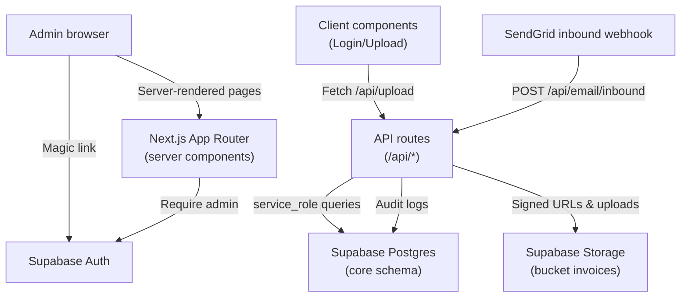

# 1. Resumen ejecutivo
- Estado general: base funcional sólida (dashboard + ingesta) pero con brechas críticas en seguridad operacional y algunos cuellos de rendimiento. El uso del service role está bien encapsulado en el backend, aunque faltan controles defensivos y observabilidad homogénea.
- Se encontraron secretos reales (service role, anon, JWT) versionados en `supabase/SUPABASE_CONFIG.md`, lo que exige rotación inmediata y refuerzo del proceso de configuración.
- Algunos endpoints críticos (`/api/invoices/[id]/download`, `/api/invoices/[id]/reprocess`) pueden fallar con redirecciones inválidas si `NEXT_PUBLIC_APP_URL` no está definido, provocando errores 500 en flujos básicos.
- El listado de clientes (`/customers`) recalcula la última factura cargando todos los registros asociados, lo que escala mal a partir de unos cientos de facturas.
- Dos implementaciones distintas de export CSV conviven sin control de memoria ni auditoría, duplicando lógica y aumentando riesgo de regresiones.
- La auditoría solo cubre parte de las rutas; `/api/upload` carece de trazas y de metadata en Storage, dificultando PII tracking y rompiendo la política `storage.objects` orientada a dueños.
- Documentación abundante, pero mezcla especificaciones históricas con el estado real del esquema (p.ej. políticas RLS y variables no usadas), lo que añade ruido al onboarding.

# 2. Scorecard 0-5
| Dimensión | Score | Justificación breve | Cómo subir +1 |
| --- | --- | --- | --- |
| Rendimiento | 3 | RPC del dashboard e índices existen, pero `/customers` y exportaciones hacen lecturas amplias sin límites. | Agregar agregados SQL/`max(created_at)` y streaming CSV para evitar cargar todo en memoria. |
| Seguridad (Auth/RLS/Storage/PII) | 1 | Service role y JWT secretos expuestos en repo; metadata de Storage ausente; rutas dependen de env opcionales. | Rotar claves, mover secretos a vault/`.env.example`, endurecer validaciones y completar metadata para políticas. |
| Calidad de código | 3 | Código legible, TS `strict`, pero con duplicaciones (`export.csv`) y varios `any`. | Centralizar clientes Supabase, tipar respuestas y eliminar endpoints duplicados. |
| Arquitectura & organización | 3 | App Router bien estructurado, pero mezcla rutas legacy y nueva capa (`lib/supabase` vs `createClient` ad-hoc). | Consolidar módulos (`supabaseAdmin` en todas las rutas) y retirar código muerto/legacy. |
| DX (experiencia dev) | 2 | Scripts mínimos, sin tests ni lint personalizado; docs contienen información obsoleta. | Añadir `npm run test`, lint configurado, checklist de setup limpio de secretos. |
| Documentación | 3 | Amplia cobertura, pero incongruente con código actual y filtra secretos. | Revisar README/ADR para reflejar la realidad y mover credenciales a gestores seguros. |
| Observabilidad mínima | 2 | Audit logs existen pero faltan en `/api/upload`/export; sin métricas ni alertas. | Estandarizar `logAudit` y añadir métricas básicas (p. ej. Supabase Edge Logging). |
| Coste / eficiencia operativa | 3 | Uso directo de Supabase sin caches; queries aceptables salvo hotspots. | Optimizar lecturas pesadas y definir políticas de retención de Storage/CSV. |

# 3. Mapa de arquitectura

# 4. Inventario del sistema
## 4.1 Endpoints y handlers
| Ruta | Método | Autorización | Descripción | Código |
| --- | --- | --- | --- | --- |
| `/api/upload` | POST | Admin sesión o `X-INTERNAL-KEY` | Sube PDF, crea cliente y factura `pending`, usa service role. | `app/api/upload/route.ts:14` |
| `/api/email/inbound` | POST | `INBOUND_EMAIL_SECRET` | Procesa webhook SendGrid, delega en `/api/upload` y hace fallback directo. | `app/api/email/inbound/route.ts:60` |
| `/api/files/signed-url` | GET | Bearer admin | Crea URL firmada para Storage con TTL ≤300s. | `app/api/files/signed-url/route.ts:20` |
| `/api/invoices/export.csv` | GET | Sesión admin | Exporta CSV completo (legacy). | `app/api/invoices/export.csv/route.ts:12` |
| `/api/export/csv` | GET | Bearer admin (JWT verificado) | Export CSV con auditoría (nueva versión). | `app/api/export/csv/route.ts:18` |
| `/api/invoices/[id]/download` | GET | Sesión admin | Firma URL del PDF y redirige. | `app/api/invoices/[id]/download/route.ts:12` |
| `/api/invoices/[id]/reprocess` | POST | Sesión admin | Marca factura como `reprocess`. | `app/api/invoices/[id]/reprocess/route.ts:12` |
| `/api/auth/callback` | GET | Público | Intercambia magic link por sesión Supabase. | `app/api/auth/callback/route.ts:12` |
| `/api/debug/customers` | GET | Admin + `NODE_ENV=development` | Lista clientes (dev only). | `app/api/debug/customers/route.ts:19` |
| `/api/debug/session` | GET | `NODE_ENV=development` + `INTERNAL_API_SECRET` | Dev helper para tokens. | `app/api/debug/session/route.ts:9` |
| `/logout` | GET/POST | Sesión | Cierra sesión y redirige. | `app/logout/route.ts:3` |

## 4.2 Modelo de datos Supabase (schema `core`)
| Objeto | Descripción | Campos clave / índices | RLS |
| --- | --- | --- | --- |
| `core.customers` | Clientes vinculados a `auth.users`. | `id`, `user_id`, `email`, `created_at`; índice único `customers_email_name_idx`. | Admin (`core.is_admin()`), service role full. `supabase/schema/structure.sql:2908` |
| `core.invoices` | Facturas con metadatos y ruta de Storage. | `customer_id` FK, `created_at`, `status`, `storage_object_path`; índices `idx_invoices_created_at`, `idx_invoices_status_created_at`, `idx_invoices_customer_issue_status`. | Admin + service role. `supabase/schema/structure.sql:2938` |
| `core.audit_logs` | Auditoría de eventos. | `event`, `entity`, `level`, `meta`; secuencia `core.audit_logs_id_seq`. | Admin lectura, service role escritura. `supabase/schema/structure.sql:2862` |
| `core.dashboard_invoice_aggregates(p_from,p_to,p_query)` | RPC JSON con totales, buckets mensuales y status. | Usa índices de `invoices`. | Ejecutable por service role. `supabase/migrations/20241019_dashboard_aggregates.sql:1` |
| `core.is_admin()` | Helper RLS (JWT role/admin flag). | — | Grant a todos los roles. `supabase/schema/structure.sql:460` |
| Triggers `trg_*_set_updated_at` | Actualiza `updated_at` en `customers`/`invoices`. | — | `supabase/schema/structure.sql:3945` |

## 4.3 Storage y políticas
- Bucket privado `invoices`; políticas permiten `select/insert/update/delete` a admin o service role y lectura por dueño vía metadata `customer_id`. `supabase/schema/structure.sql:4403`.
- Faltan metadatos en uploads manuales (`app/api/upload/route.ts:58`), por lo que la política de owner no se cumple.

## 4.4 Variables de entorno
| Variable | Scope | Uso | Referencia |
| --- | --- | --- | --- |
| `NEXT_PUBLIC_SUPABASE_URL` | Cliente + servidor | Inicializa clientes Supabase. | `lib/supabase/server.ts:4` |
| `NEXT_PUBLIC_SUPABASE_ANON_KEY` | Cliente + servidor | Auth anónima para SSR/CSR. | `lib/supabase/server.ts:5` |
| `SUPABASE_SERVICE_ROLE_KEY` | Solo servidor | Operaciones con privilegio (DB + Storage). | `lib/supabase/admin.ts:5` |
| `SUPABASE_JWT_SECRET` | Solo servidor | Verificar Bearer tokens (`assertAdminFromAuthHeader`). | `lib/supabase.ts:47` |
| `NEXT_PUBLIC_APP_URL` | Cliente + servidor | Base de redirects (login/logout). | `app/login/login-form.tsx:17` |
| `ADMIN_EMAIL` / `ADMIN_EMAILS` | Servidor | Lista blanca de admins. | `app/api/upload/route.ts:21` |
| `ADMIN_USER_ID` | Servidor | Owner de clientes creados automáticamente. | `lib/customers.ts:32` |
| `INTERNAL_API_SECRET` | Servidor | Auth interna `/api/upload` y `/api/debug/session`. | `app/api/upload/route.ts:20` |
| `INBOUND_EMAIL_SECRET` | Servidor | Protege webhook SendGrid. | `app/api/email/inbound/route.ts:10` |
| `STORAGE_INVOICES_BUCKET` | Servidor | Nombre de bucket (default `invoices`). | `app/api/upload/route.ts:45` |
| `STORAGE_SIGNED_URL_TTL_SECS` | Servidor | TTL URLs firmadas. | `app/api/invoices/[id]/download/route.ts:34` |
| `NODE_ENV` | Servidor | Habilita rutas dev-only. | `app/api/debug/customers/route.ts:17` |

# 5. Hotspots de rendimiento
| Hotspot | Impacto | Alternativas (pros/cons/esfuerzo) | Recomendación |
| --- | --- | --- | --- |
| `/customers` calcula `lastInvoiceAt` cargando todas las facturas asociadas (`app/customers/page.tsx:41`). | Escala O(N·M): cada navegación carga todas las facturas de los clientes mostrados; >5k facturas impactará latencia y coste de salida. | 1) **SQL agregado**: `select customer_id, max(created_at)` vía RPC o `select(...).select('max:created_at')` (Pros: una query O(N), compatible con RLS; Cons: requiere migración/refactor). Esfuerzo M. 2) **Materializar campo** `customers.last_invoice_at` con trigger (Pros: lecturas O(1); Cons: trigger extra, consistente si todas rutas lo actualizan). Esfuerzo M. 3) **Límite parcial**: usar `limit` + `distinct on (customer_id)` (Pros: sin migraciones; Cons: sintaxis más compleja en Supabase). Esfuerzo S. | Implementar alternativa 1 (RPC/`max`) para mantener lógica en DB y reducir payload inmediato. |
| Export CSV legacy carga dataset completo en memoria (`app/api/invoices/export.csv/route.ts:27`). | Riesgo de tiempos de respuesta altos y OOM cuando el rango cubre miles de filas; duplica lógica con `app/api/export/csv`. | 1) **Unificar con endpoint nuevo** y devolver `ReadableStream` (Pros: reaprovecha auditoría existente; Cons: requiere stream manual). Esfuerzo M. 2) **Postgres `COPY (SELECT ...) TO STDOUT`** vía Supabase Edge Function (Pros: streaming nativo; Cons: nueva función). Esfuerzo M/L. 3) **Generar CSV en Storage y devolver URL firmada** (Pros: reutilizable; Cons: requiere borrado/GC). Esfuerzo M. | Consolidar en `/api/export/csv` con streaming y retirar ruta legacy para evitar duplicación. |
| Webhook email duplica lectura del PDF (arrayBuffer + fetch interno) (`app/api/email/inbound/route.ts:118`). | Cada mensaje re-envía el PDF al mismo host, duplicando CPU/memoria y latencia; con adjuntos grandes se agrava. | 1) **Extraer helper común** para subir directamente (Pros: elimina roundtrip; Cons: refactor). Esfuerzo M. 2) **Usar Storage Multipart API** para stream sin cargar en memoria (Pros: maneja archivos grandes; Cons: cambios mayores). Esfuerzo L/M. 3) **Incrementar límite y telemetría** (Pros: rápida; Cons: solo mitigación, no soluciona duplicación). Esfuerzo S. | Aplicar alternativa 1: reutilizar lógica de subida sin `fetch`, manteniendo fallback como plan B. |

# 6. Seguridad y privacidad
| Ítem | Estado | Observaciones |
| --- | --- | --- |
| Gestión de secretos | ❌ | Credenciales reales (anon, service role, JWT) versionadas en `supabase/SUPABASE_CONFIG.md:183`. Rotar y remover inmediatamente. |
| Auth admin | ✅ | `requireAdmin()` verifica rol/email; rutas API comprueban token o clave interna. |
| Uso `service_role` | ⚠️ | Encapsulado en backend, pero algunas rutas usan `createClient` ad-hoc en vez de `supabaseAdmin`, repitiendo lógica (`app/api/invoices/export.csv:27`). |
| RLS BD | ✅ | Políticas admin/service definidas para `core.*` con helper `core.is_admin()`. |
| Storage | ⚠️ | Políticas requieren metadata `customer_id`; `/api/upload` no la adjunta, impidiendo acceso por owner y dificultando auditoría. |
| URLs firmadas | ✅ | TTL configurable (clamp a 300s) y validador de path. |
| PII en logs | ⚠️ | Audit logs guardan emails y subjects (e.g. `app/api/email/inbound/route.ts:81`); definir retención y anonimización parcial. |
| Dev utilities | ⚠️ | `/api/debug/*` protegidos por `NODE_ENV` pero conviene doble verificación (por ejemplo, cabecera `X-Env-Guard`). |

# 7. Calidad y arquitectura
- Duplicidad de endpoints CSV (`app/api/export/csv/route.ts:18` vs `app/api/invoices/export.csv/route.ts:12`).
- Uso inconsistente de helpers Supabase (`createClient` directo vs `supabaseAdmin`).
- Componentes server devuelven `any` (ej. `app/invoices/page.tsx:88`) y rutas repiten lógica de parse Bearer.
- `buildInvoiceStoragePath` expone email en rutas (PII) — considerar hash o identificador opaco.
- Falta de pruebas unitarias/E2E integradas en repo; scripts mencionados en docs no existen (`supabase/tests`).

# 8. Roadmap propuesto
## Quick Wins (1–3 días)
1. Rotar y eliminar secretos del repositorio; proveer `.env.example` sin claves reales (`supabase/SUPABASE_CONFIG.md:183`).
2. Añadir fallback seguro para redirects cuando `NEXT_PUBLIC_APP_URL` no esté configurado (`app/api/invoices/[id]/download/route.ts:17`, `app/api/invoices/[id]/reprocess/route.ts:33`).
3. Usar helper `supabaseAdmin()` en rutas legacy y adjuntar metadata `customer_id`/`actor_user_id` en `/api/upload`. Registrar éxito/error con `logAudit`.
4. Unificar endpoints CSV retirando la versión legacy y reutilizando la instrumentada.

## Core (1–2 sprints)
1. Refactor `/customers` para emplear agregados SQL o vista materializada ligera con índices dedicados.
2. Reestructurar webhook email para evitar doble upload en memoria e instrumentar métricas básicas.
3. Formalizar pruebas (lint + contrato Supabase via RPC mocks) y documentación sincronizada con esquema real.
4. Definir política de retención/anonimización para audit logs y Storage paths (e.g. hash de email).

## Plus (1–2 meses)
1. Implementar pipeline de observabilidad (Supabase logs centralizados, alertas sobre errores 5xx y colas de email).
2. Evaluar cache o job async para exportaciones/firmas masivas y límites de cuota en Storage.
3. Diseñar permisos multi-tenant si se planea abrir a múltiples usuarios (nuevas RLS y claims).

# 9. Suposiciones
- Se asume que el proyecto seguirá operando con un único admin; si se amplía a clientes finales, se requieren nuevas políticas RLS.
- No se dispone de métricas reales de volumen, por lo que estimaciones de esfuerzo se basan en patrones típicos de Supabase.
- Scripts mencionados en documentación (`supabase/tests/runner.sh`) no están presentes; se asume que eran artefactos históricos.
